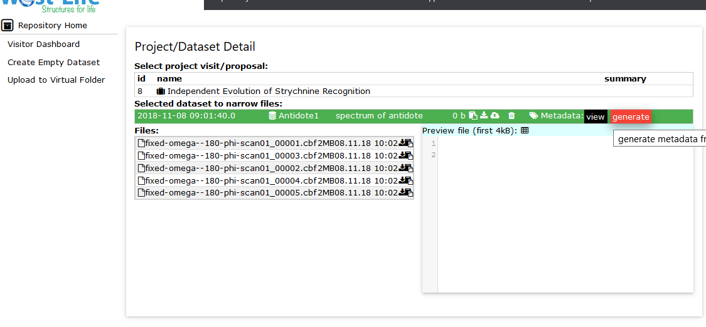
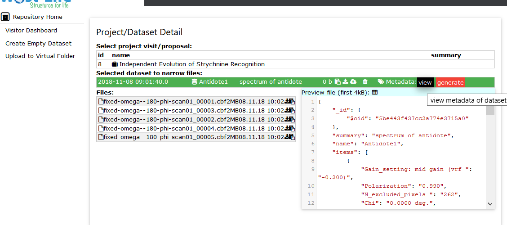

# Scientist works with metadata

A scientist can generate metadata for dataset. 
When a `generate` metadata button is pressed, a background process is launched. It harvest all files within the dataset to collect possible metadata in the headers of the file. By default, it reads tries to read text information in the form `key value` or `key = value` or `key:value`. Existing metadata are replaced.

Previously generated metadata can be viewed using `view` metadata button.

