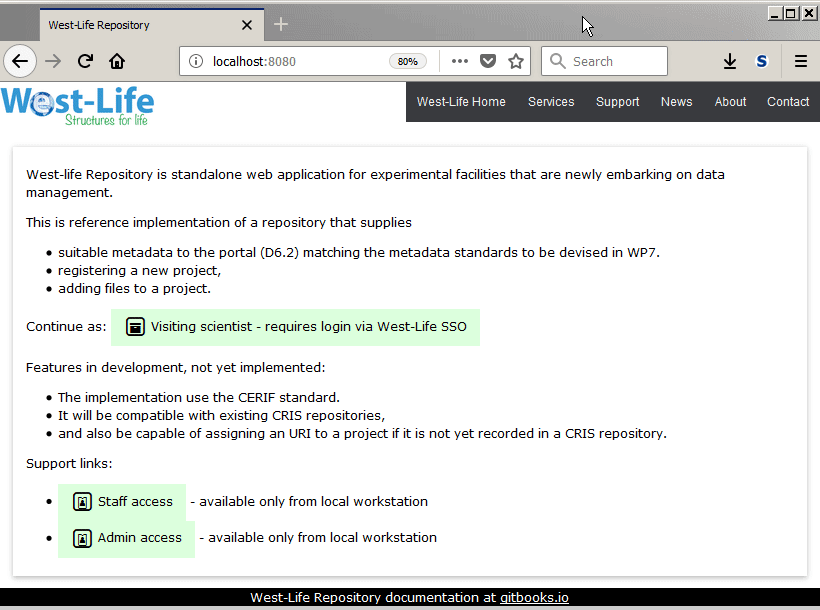

# Scientist imports project proposal

A scientist visits facility based on previous project proposal submission. Scientist can import the project proposal information into the repository web application:

1. Log-in as "Visiting Scientist"
2. Click on "Import from ARIA service"
3. * redirected to ARIA - Login and click "Allow ACCESS" 
4. Select available proposals and click "Import proposal"

