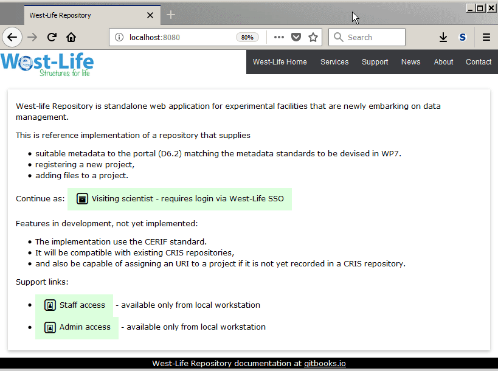

# Scientist works with dataset

A scientist can browse data in dataset, generate and view metadata, upload dataset files into his Virtual Folder account.

1. Login
2. Select project or dataset directly.
3. browse available files. Each click on file will show header of the file
4. icons next to dataset allow to generate and view metadata, download dataset, upload to Virtual Folder or delete the dataset.

   

