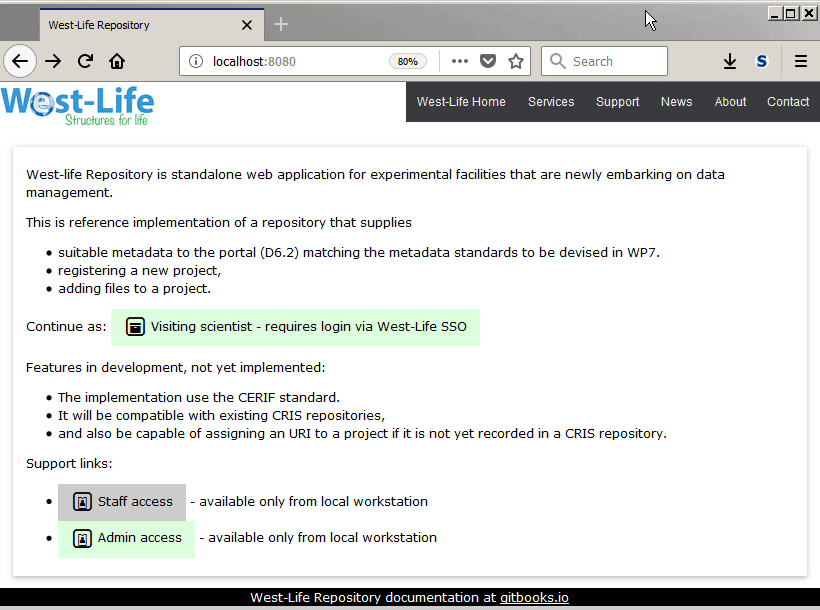

# Staff uploads data

A member of staff can upload data obtained during scientist visit into the Scientist's account and bind it to an existing project.

1. Log-in as staff "Staff access"
2. On staff dashboard Select user - visiting scientist
3. Select existing dataset OR create empty dataset - select project proposal, fill dataset name - click submit 
4. drag and drop files, or browse files by buttons.
5. click Upload files.

