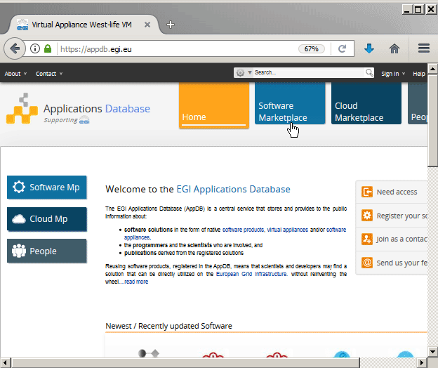

# Cloud installation

In order to install Virtual Folder in VM or in cloud environment you may use prepared images: 1. [https://appdb.egi.eu/store/vappliance/d6.1.virtualfoldervm](https://appdb.egi.eu/store/vappliance/d6.1.virtualfoldervm) - The standard OVA \(open virtual appliance\) image can be used to deploy West-Life VM into e.g. OpenNebula cloud environment. 2. [https://appdb.egi.eu/store/vappliance/west.life.vm](https://appdb.egi.eu/store/vappliance/west.life.vm) - RAW image can be used to deploy West-Life VM into OpenStack cloud environment These images contains default contextualization to binary installation of virtual folder in /cvmfs. Both images are small \(18 MB, 23 MB respectively\) containing only CernVM 4 bootloader, which boots into standard Scientific Linux \(currently version 7.3\) and contextualizes it with West-Life specific software:

Or you may use any generic image of CernVM 4 or RHEL7 based OS \(Centos 7\) and for binary installation just launch script at `/cvmfs/west-life.egi.eu/software/virtualfolder/latest/bootstrap/bootstrapcloud.sh`. For installation from source codes, launch

```bash
#!/usr/bin/env bash
mkdir -p /opt/virtualfolder-src
cd /opt/virtualfolder-src
git clone https://github.com/h2020-westlife-eu/west-life-wp6.git
export WP6SRC=/opt/virtualfolder-src/west-life-wp6/wp6-virtualfolder
export PORTAL_DEPLOYMENT=0  # 1 =enable VRE - multiuser environment
export SSO_DEPLOYMENT=0 # 1 =enable SSO -multiuser environment
chown -R vagrant:vagrant $WP6SRC
$WP6SRC/bootstrap/bootstrap.sh
```

## Downloading VM image

You may download the latest West-life VM in the OVA compatible format from

[https://appdb.egi.eu/store/vappliance/d6.1.virtualfoldervm](https://appdb.egi.eu/store/vappliance/d6.1.virtualfoldervm)



Alternatively you may use the RAW image for deployment into OpenStack at [https://appdb.egi.eu/store/vappliance/west.life.vm](https://appdb.egi.eu/store/vappliance/west.life.vm)

Use the downloaded image to deploy it to prefered provider. You may deploy the image in EGI resources - follow EGI documentation.

## Contextualization

OVA image for OpenNebula contains by default contextualization, RAW image for OpenStack contains reference to cloud-init file which needs to be provided in order to boot Virtual Folder and related software during first boot. By default the image contextualization is set to use direct connection to CernVM-FS repositories. If you have local squid proxy server, it is very recommended to configure it in contextualization script.

```text
[ucernvm-begin]
cvmfs_http_proxy=http://<host>:<port>
[ucernvm-end]

[cernvm]
proxy = http://<host>:<port>;DIRECT
```

Further information about contextualization of CernVM can be found at [https://cernvm.cern.ch/portal/contextualisation](https://cernvm.cern.ch/portal/contextualisation)

