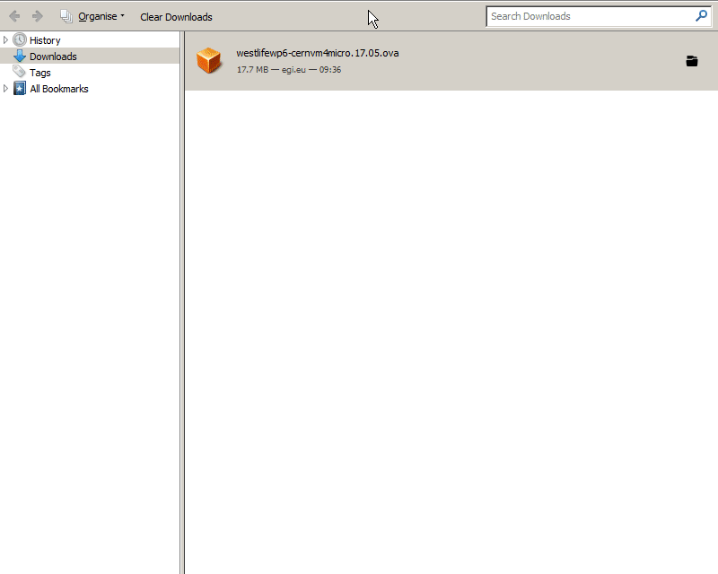
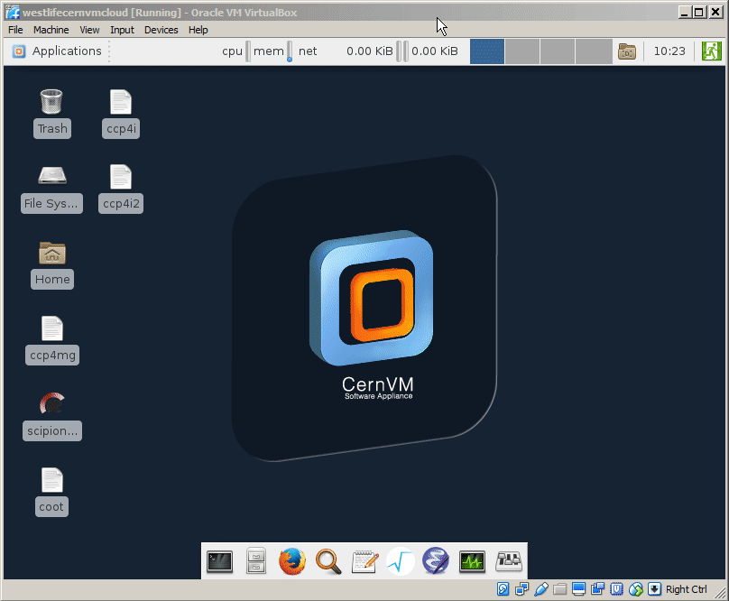

# Local installation

It's possible to test the virtual folder locally, there are these options:

1. \(requirements VirtualBox\). 

   Download the VM template for Open Nebula and import it into your private instance of VirtualBox.

2. \(requirements VirtualBox + Vagrant tool\)

## Using VM template for OpenNebula

Download the latest West-life VM in the OVA compatible format from

[https://appdb.egi.eu/store/vappliance/d6.1.virtualfoldervm](https://appdb.egi.eu/store/vappliance/d6.1.virtualfoldervm)


Import the downloaded image into VirtualBox.

 The size of OVA image is very small \(18 MB\) as it contains only micro kernel of CernVM 4. It bootstraps the rest of operating system \(based on Scientific Linux 7\) and additional software from Internet. It may download about 100-200 MB during initial boot, and it can take about several minutes.

Desktop of VM is accessible via VirtualBox tool. 

## Using Vagrant tool and VirtualBox

You need Vagrant tool [www.vagrantup.com](https://www.vagrantup.com/) and VirtualBox [www.virtualbox.org](https://www.virtualbox.org/). And use binary installation based on CernVM4 OS.

```bash
git clone https://github.com/h2020-westlife-eu/wp6-vm.git
cd wp6-vm/vf-standalone-bin/
vagrant up
```

For full options available for local installation, see [Virtual Machines](../../virtual-machines.md)

