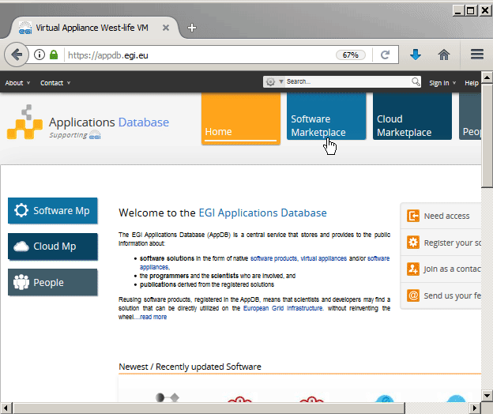

# Local installation

In order to install/launch legacy software and have access to a desktop you may install the virtual folder with selected software suites either on your cloud provider, or locally on your server, cluster, workstation or even laptop.

The standard procedure is to download virtual machine template image from appDB \(18MB\). If you would like to have testing environment set by Vagrant tool and VirtualBox, follow [Development installation](https://github.com/h2020-westlife-eu/virtual-folder-docs/tree/85c40aad132037341365c7bade20b38dc642de6b/virtualfolder/installation-guide/Development%20installation/README.md) chapter.

## Downloading VM image

You may download the latest West-life VM in the OVA compatible format from

[https://appdb.egi.eu/store/vappliance/d6.1.virtualfoldervm](https://appdb.egi.eu/store/vappliance/d6.1.virtualfoldervm)

Alternatively you may use the RAW image for deployment into OpenStack at [https://appdb.egi.eu/store/vappliance/west.life.vm](https://appdb.egi.eu/store/vappliance/west.life.vm)

### Deployment to local VirtualBox

For testing purposes you may import the image into local installation of VirtualBox.

The OVA image initially 18 MB bootstraps operating system and additional software by downloadin about 100-200 MB, the initial bootstrap can take about several minutes. You can access the desktop directly.

