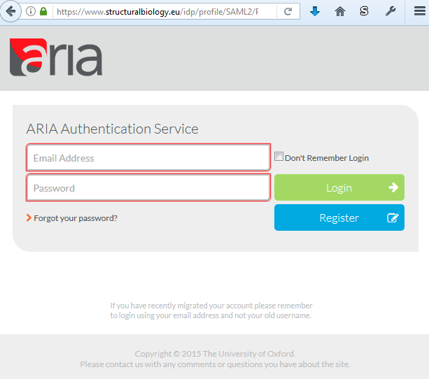
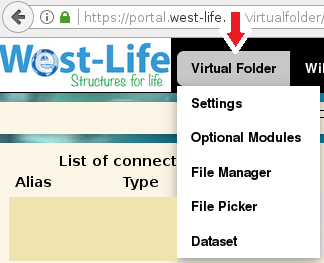

# User's guide

The Virtual Folder is accessible from the West-life portal at [https://portal.west-life.eu](https://portal.west-life.eu)

After you click the Login page, you will be redirected to authentication service \(ARIA operated by Instruct, or West-Life SSO\). You can login or create a new account.

After succesful login, you'll be redirected to your account in Virtual Folder at. [https://portal.west-life.eu/virtualfolder/](https://portal.west-life.eu/virtualfolder/).

User can navigate through Virtual Folder components by hovering the 'Virtual Folder' menu.

UI allows to do these basic tasks: 1. [Settings](settings/) allow you to connect to your scattered data \(B2DROP, DROPBOX, any WEBDAV capable and FILESYSTEM \(in local deployment\) type is supported\). 2. [File manager](file-manager.md) is for browsing scattered data, check them. It allows basic visualization of text, image and PDB files 3. [File picker](file-picker.md) is to choose a file and generate publicly accessible URL refering this file. It can be used to download the file or upload to the selected folder using WEBDAV protocol.

