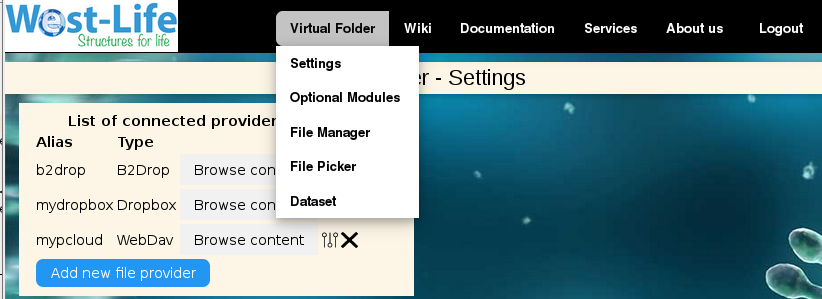
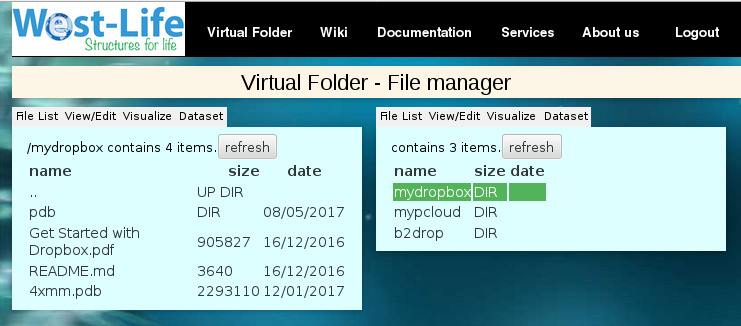
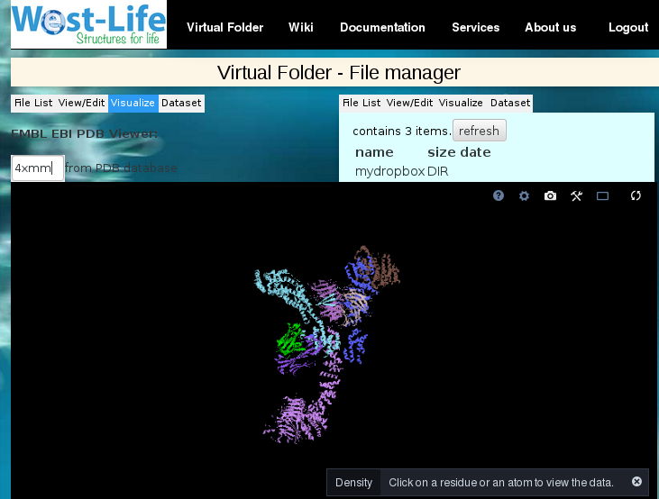
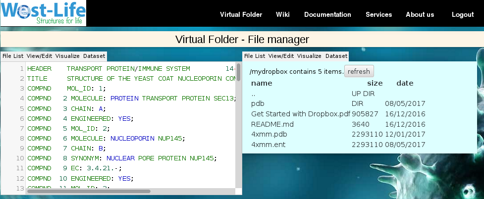
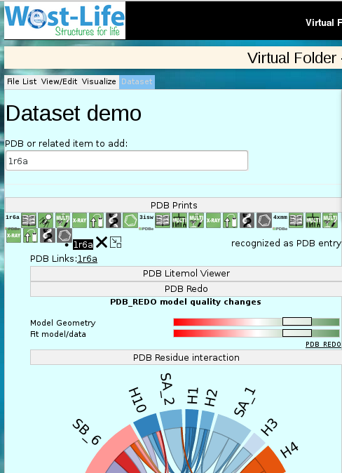

File Manager
============

| To use the File manager of the Virtual Folder, either go directly to
| https://portal.west-life.eu/virtualfolder/filemanager.html
| or click on the 'Browse content' button on any connected provider or
hover over the "Virtual Folder" menu entry and click the 'File Manager'
menu item.

.. figure:: ../../.gitbook/assets/filemanager2%20%281%29.PNG
   :alt: 

File list view
--------------

The file manager consists of 2 panels, you can browse the directory
structure on each panel. Clicking on directory shows details of the
directory, clicking in '..' goes into parent directory:

Visualize
---------

Clicking on any file with PDB extension will switch to the Visualize tab
- (LiteMol component integrated from
https://www.ebi.ac.uk/pdbe/pdb-component-library/doc.html#a_LiteMol)

View/Edit
---------

Clicking on any file with extension other than PDB will switch to
View/Edit -

Dataset
-------

Clicking on the Dataset pane change the view to dataset definition
dialog.

