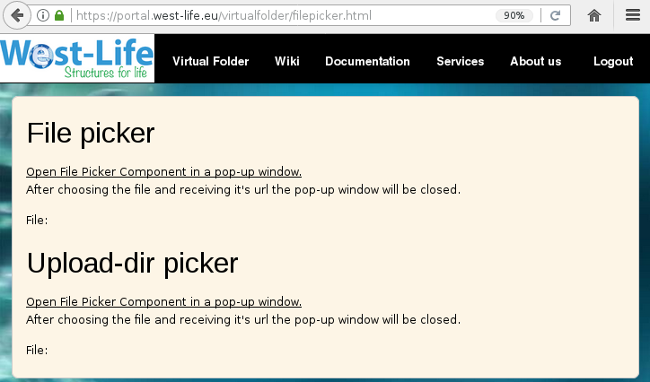
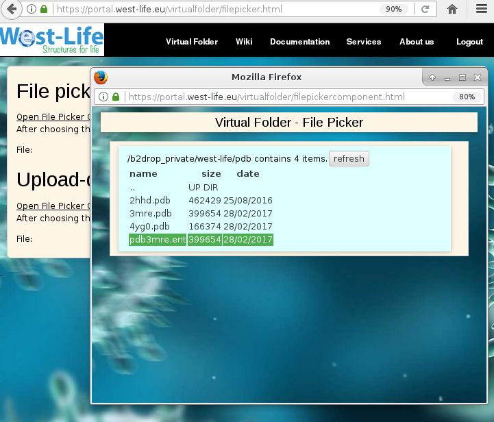
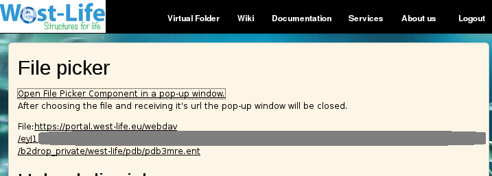

# File Picker

## File picker

You can use the file picker component to select a file from any storage repository which you have connected to the virtual folder and generate publicly accessible URL which can be used to download the file from virtual folder. In order to integrate File picking into your web application follow [Integration guide -&gt; Select File or Dir from Virtual Folder](../integration-guide/select-file-or-dir-from-virtual-folder.md).

Exemplar file picker and upload dir picker web application is at

[https://portal.west-life.eu/virtualfolder/filepicker.html](https://portal.west-life.eu/virtualfolder/filepicker.html)



```text
click the link 'Open File Picker Component'
```

Popup window appears where you can browser and choose the file to be picked.



AFter selecting a file the generated link can be used to access the file directly



## Upload dir picker

To pick directory within Virtual Folder, where a results can be uploaded directly, the second component 'Upload Dir picker' can be used.

