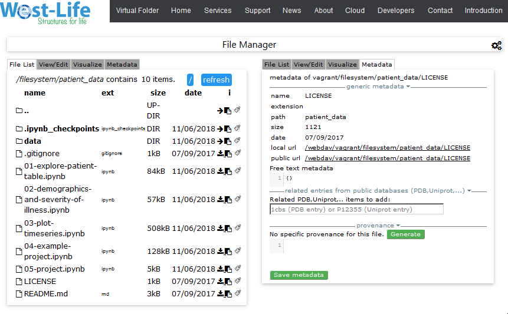
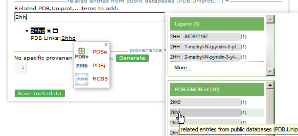
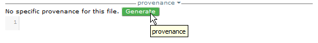
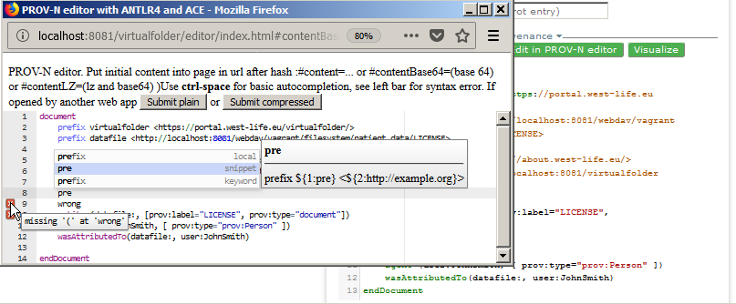
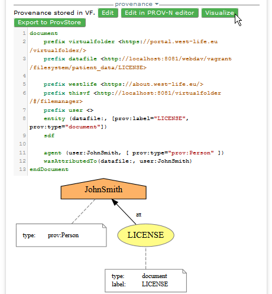
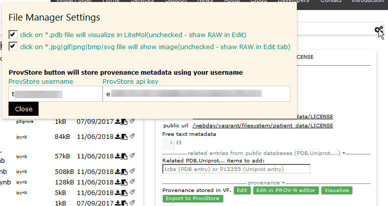

# Metadata

Metadata tab allows to view and edit generic metadata, related PDB or Uniprot entries and provenance in PROV-N notation.

Click on a small badge symbol  in order to view metadata. By default, generic metadata are seen, like name, path and url to the resource. 

To link related Protein DataBase Entry or Uniprot entry, just start to type beginning of PDB Id and select relevant from the pop up dialog. Existing PDB Links can be followed to selected database instances \(shown PDBe,PDBj and RCSB\)

'Generate' button generates initial provenance document based on generic metadata available.

'Edit' button enables basic editing.

'Edit in PROV-N editor' opens pop up window with PROV-N editor able to check and highlight syntax per PROV-N standard. 'Submit plain' or 'Submit compressed' closes the editor and send the updated content in the provenance section of metadata.

'Visualize' button shows visualization of current document.

'Export to ProvStore' submits the document into ProvStore account. Note that ProvStore username and ProvStore api key should be filled before in 'File Manager Settings' Dialog. 

