# Settings

## Connecting Scattered Data

In order to use the Virtual Folder, you need to connect some storage where your scattered data are accessible.

```text
Add new file provider -> Choose provider
```

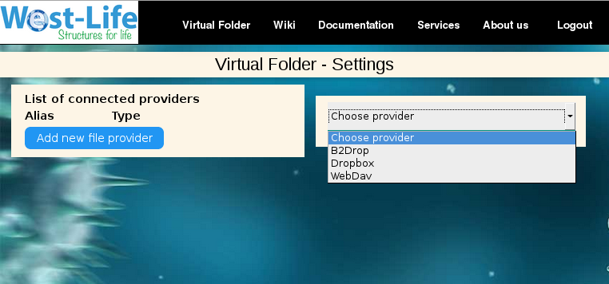

The B2DROP, Dropbox and any storage provider offering a [standard WebDAV connection](https://www.ietf.org/rfc/rfc4918.txt) are supported.

## B2DROP

[B2DROP is a secure and trusted data exchange service for researchers and scientists.](https://eudat.eu/services/b2drop) West-life portal uses B2DROP TO store, upload and download AND share the data files.

You need to create B2DROP account first at [https://b2drop.eudat.eu/pwm/public/NewUser?](https://b2drop.eudat.eu/pwm/public/NewUser?)

```text
Select B2DROP -> Fill in the existing B2DROP username and password -> click Add
```

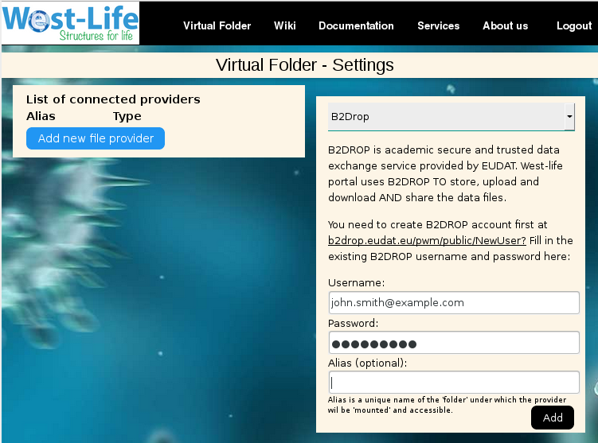

After clicking the Add button, and if everything works well, the connected B2DROP account should appear in the list:

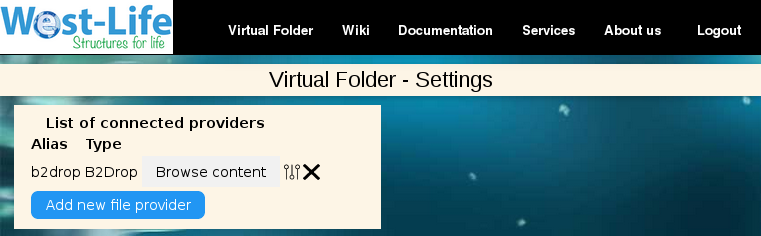

## DropBox

DROPBOX is a commercial data store and exchange service. West-life portal can use your DROPBOX account to access and download your data files.

```text
Select DropBox -> click 'Connect to DROPBOX'
```

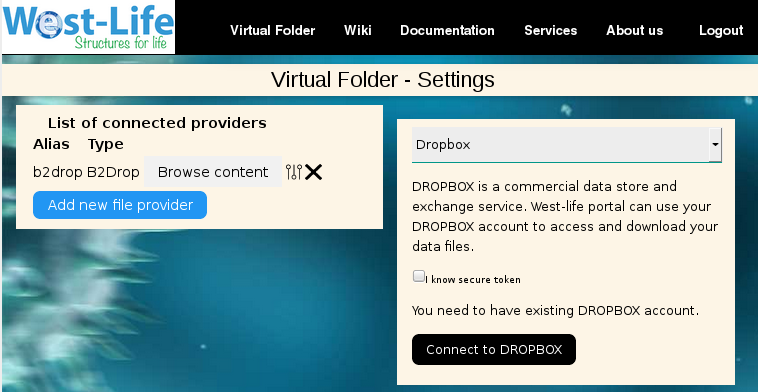

You will be redirected to sign in or create Dropbox account. After login, you'll be asked to allow Virtual Folder to access your data:

```text
Click Allow
```

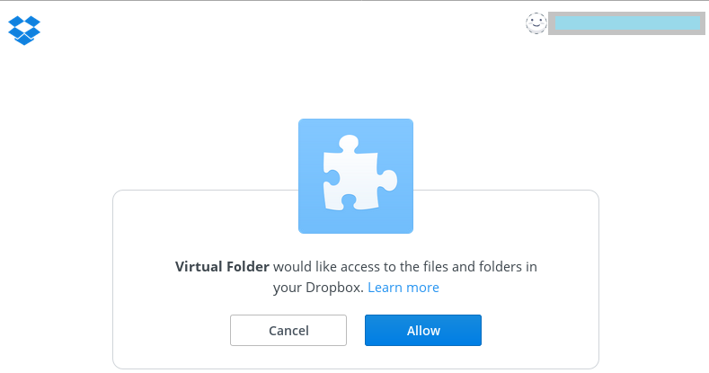

You'll be redirected back to Virtual Folder. You should see a unique secure token being filled into the secure token field. Do not change it. You can optionally fill the 'Alias'.

```text
click Add
```

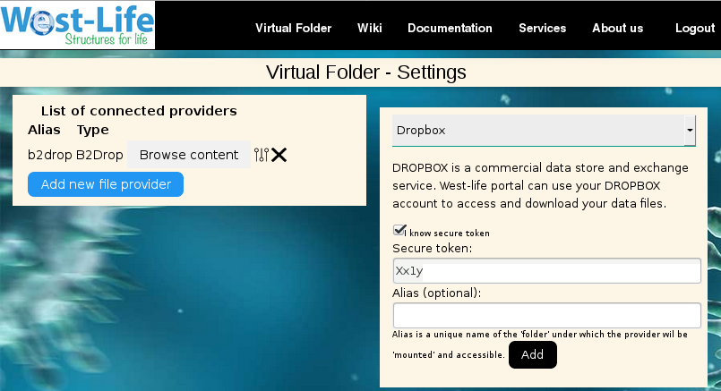

After clicking the Add button, and if everything works well, the connected DROPBOX account should appear in the list:

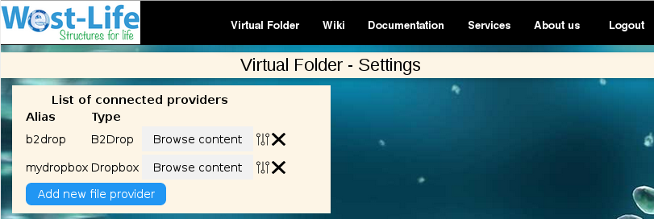

## WEBDAV

If your data provider allows a WEBDAV protocol, this can be connected.

```text
Add new file provider -> Select 'WEBDAV'
```

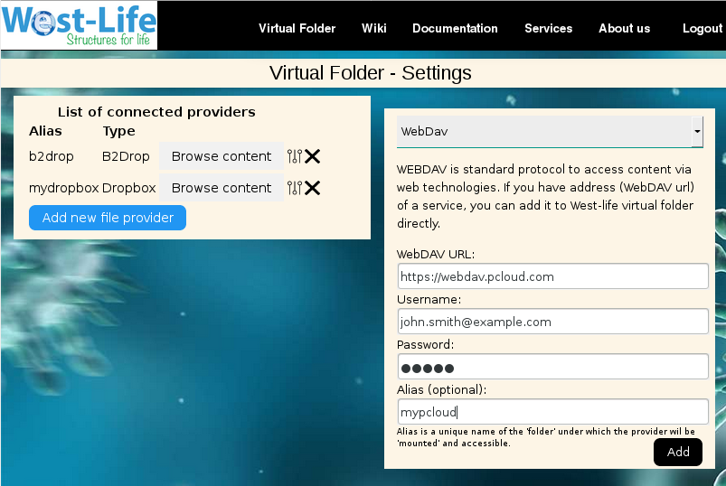

```text
Fill in the WebDAV URL and account information -> click Add
```

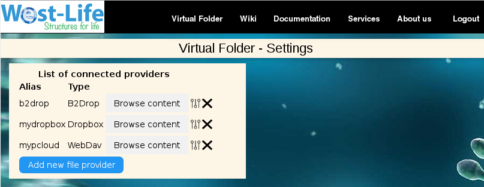

After clicking the Add button, and if everything works well, the connected WEBDAV provider should appear in the list.

## Filesystem

In local deployment installation, you may allow access to directory where virtual folder is installed.
E.g. shared directory within your local network etc.
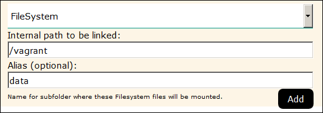

## Import Settings

You may import settings from another deployment of virtual folder, e.g. import settings from your public virtual folder to the local one using "Import from public Virtual Folder".
Leave the default URL of Virtual Folder or change it, if you would liek to import from different instance (e.g. another local installation).
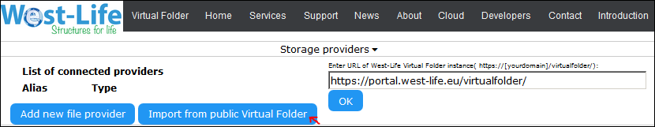
Pop up window will allow you to select settings to be imported.
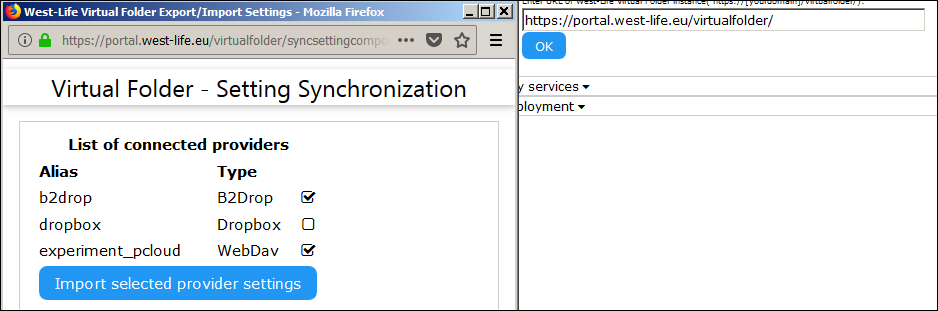
After that you may choose to rename aliases, if they conflict with local one.
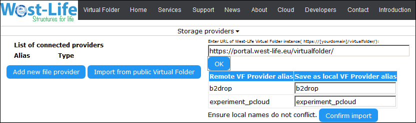


 

 