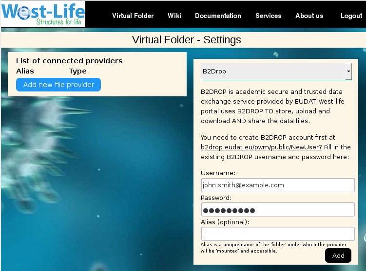
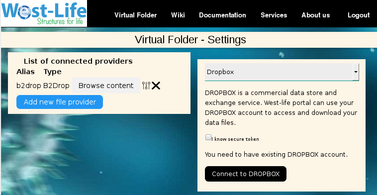

Settings
========

Connecting Scattered Data
-------------------------

In order to use the Virtual Folder, you need to connect some storage
where your scattered data are accessible.

.. code:: text

    Add new file provider -> Choose provider

.. figure:: ../../.gitbook/assets/settings.PNG
   :alt: 

The B2DROP, Dropbox and any storage provider offering a `standard WebDAV
connection <https://www.ietf.org/rfc/rfc4918.txt>`__ are supported.

B2DROP
------

`B2DROP is a secure and trusted data exchange service for researchers
and scientists. <https://eudat.eu/services/b2drop>`__ West-life portal
uses B2DROP TO store, upload and download AND share the data files.

You need to create B2DROP account first at
https://b2drop.eudat.eu/pwm/public/NewUser?

.. code:: text

    Select B2DROP -> Fill in the existing B2DROP username and password -> click Add

After clicking the Add button, and if everything works well, the
connected B2DROP account should appear in the list:

.. figure:: ../../.gitbook/assets/settings1.PNG
   :alt: 

DropBox
-------

DROPBOX is a commercial data store and exchange service. West-life
portal can use your DROPBOX account to access and download your data
files.

.. code:: text

    Select DropBox -> click 'Connect to DROPBOX'

You will be redirected to sign in or create Dropbox account. After
login, you'll be asked to allow Virtual Folder to access your data:

.. code:: text

    Click Allow

.. figure:: ../../.gitbook/assets/settingsdropbox3.PNG
   :alt: 

You'll be redirected back to Virtual Folder. You should see a unique
secure token being filled into the secure token field. Do not change it.
You can optionally fill the 'Alias'.

.. code:: text

    click Add

.. figure:: ../../.gitbook/assets/settingsdropbox4.PNG
   :alt: 

After clicking the Add button, and if everything works well, the
connected DROPBOX account should appear in the list:

.. figure:: ../../.gitbook/assets/settingsdropbox5.PNG
   :alt: 

WEBDAV
------

If your data provider allows a WEBDAV protocol, this can be connected.

.. code:: text

    Add new file provider -> Select 'WEBDAV'

.. figure:: ../../.gitbook/assets/settingswebdav1.PNG
   :alt: 

.. code:: text

    Fill in the WebDAV URL and account information -> click Add

.. figure:: ../../.gitbook/assets/settingswebdav2.PNG
   :alt: 

After clicking the Add button, and if everything works well, the
connected WEBDAV provider should appear in the list.
