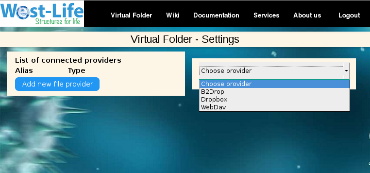
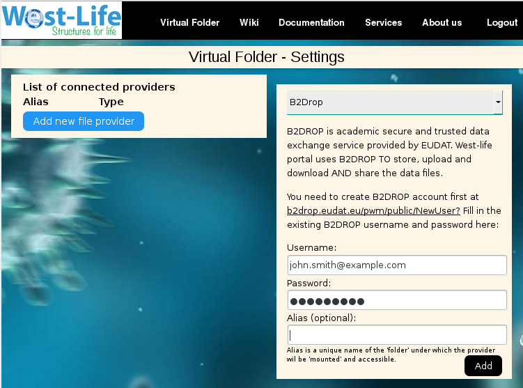
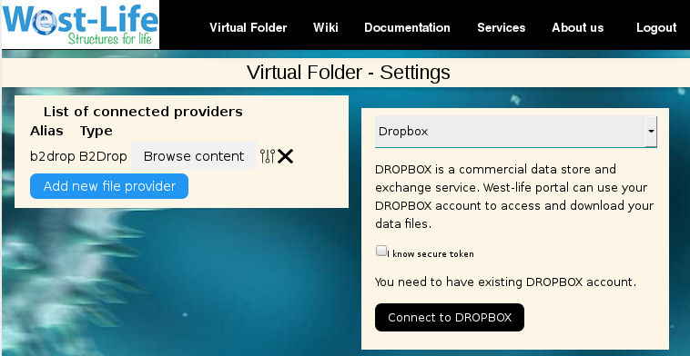
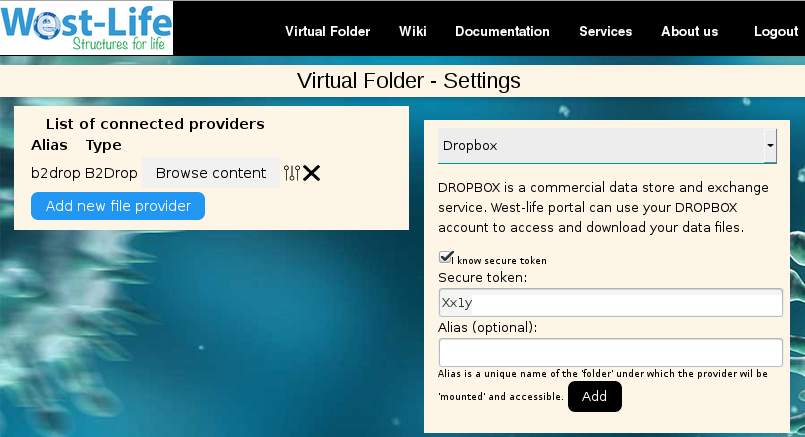
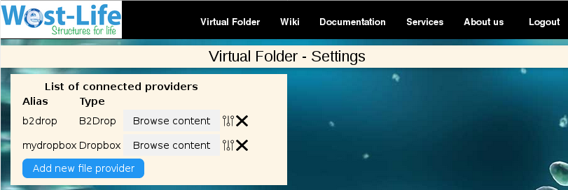
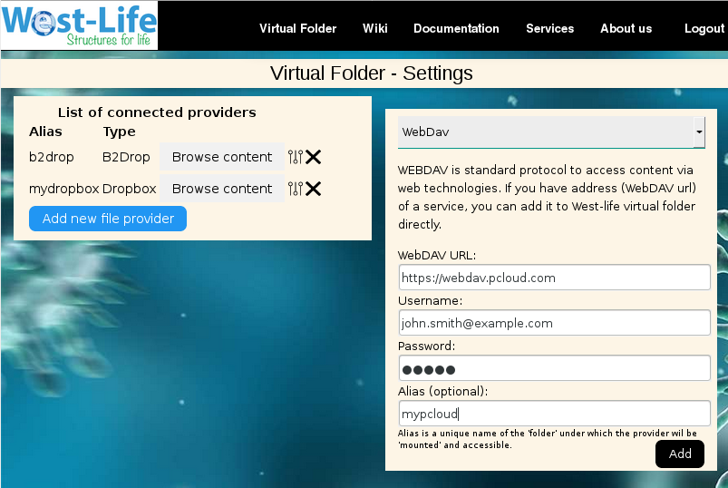
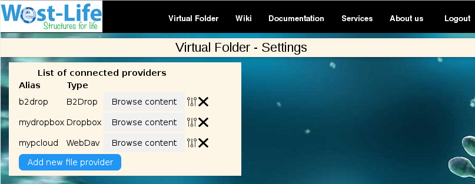

# Settings

## Connecting Scattered Data

In order to use the Virtual Folder, you need to connect some storage where your scattered data are accessible.

```text
Add new file provider -> Choose provider
```



The B2DROP, Dropbox and any storage provider offering a [standard WebDAV connection](https://www.ietf.org/rfc/rfc4918.txt) are supported.

## B2DROP

[B2DROP is a secure and trusted data exchange service for researchers and scientists.](https://eudat.eu/services/b2drop) West-life portal uses B2DROP TO store, upload and download AND share the data files.

You need to create B2DROP account first at [https://b2drop.eudat.eu/pwm/public/NewUser?](https://b2drop.eudat.eu/pwm/public/NewUser?)

```text
Select B2DROP -> Fill in the existing B2DROP username and password -> click Add
```



After clicking the Add button, and if everything works well, the connected B2DROP account should appear in the list:


## DropBox

DROPBOX is a commercial data store and exchange service. West-life portal can use your DROPBOX account to access and download your data files.

```text
Select DropBox -> click 'Connect to DROPBOX'
```



You will be redirected to sign in or create Dropbox account. After login, you'll be asked to allow Virtual Folder to access your data:

```text
Click Allow
```


You'll be redirected back to Virtual Folder. You should see a unique secure token being filled into the secure token field. Do not change it. You can optionally fill the 'Alias'.

```text
click Add
```



After clicking the Add button, and if everything works well, the connected DROPBOX account should appear in the list:



## WEBDAV

If your data provider allows a WEBDAV protocol, this can be connected.

```text
Add new file provider -> Select 'WEBDAV'
```



```text
Fill in the WebDAV URL and account information -> click Add
```



After clicking the Add button, and if everything works well, the connected WEBDAV provider should appear in the list.

## Filesystem

In local deployment installation, you may allow access to directory where virtual folder is installed. E.g. shared directory within your local network etc. 

