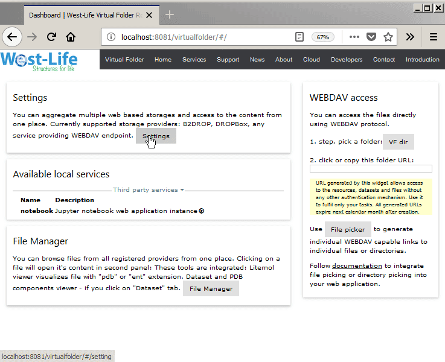
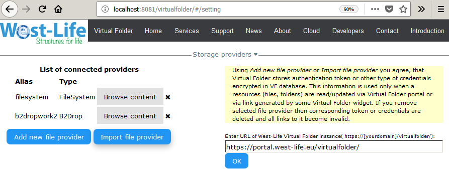
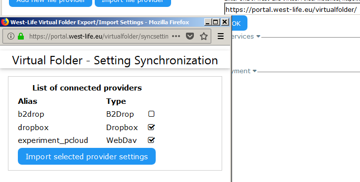
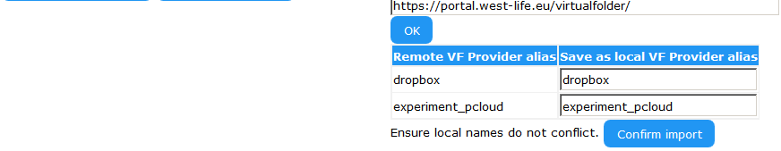

# Import settings from another Virtual Folder

You may import settings from another deployment of virtual folder, e.g. import settings from your public virtual folder to the local one using "Import from public Virtual Folder". 

* Go to settings page "Virtual Folder" -&gt; "Setting" 

* click "Import File Provider" button

* Enter URL of West-Life Virtual Folder instance and click "OK". Pop up window will appear.
* Select providers you would like to import and click "Import selected provider setting"

* The settings will appear in confirmation dialog, you may change alias of providers in case there is conflict with existing one.

* The settings are imported and available in your Virtual Folder instance.

A one-time RSA 2048 keys and AES encryption are used to transfer settings as they contain tokens or credentials to access your data. For technical details follow Developer's guide -&gt; Import Export Settings API

