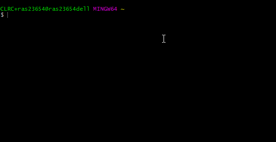

# Virtual Machines and Containers

To deploy VF or any other product, the following is recommended. 

* Base virtual machine or container
  * Scientific Linux 7
  * CernVM 4
  * any derivative of RHEL 7 
* Contextualization into 
  * binaries - from `/cvmfs/west-life.egi.eu`
  * sources - from [https://github.com/h2020-westlife-eu](https://github.com/h2020-westlife-eu) 

The GIT repository [https://github.com/h2020-westlife-eu/wp6-vm.git](https://github.com/h2020-westlife-eu/wp6-vm.git) contains various configuration for development and testing purposes using vagrant tool to prepare virtual machines in Virtual Box.

### Prerequisites

1. Vagrant - tool for automation of virtual machine deployment. 
   1. For MS Windows - Download and install vagrant from [https://www.vagrantup.com/](https://www.vagrantup.com/)  \(tested on/recommended version vagrant 1.9.6, vagrant 2.0.3 on Windows requires updated Powershell, e.g. via Windows Management Framework WMF 5.1 [https://www.microsoft.com/en-us/download/details.aspx?id=54616](https://www.microsoft.com/en-us/download/details.aspx?id=54616)\) 
   2. For Linux - use prefered package management
      1. Ubuntu:`apt install vagrant`
      2. Centos\(RHEL\):`yum install vagrant`
2. Virtualbox - VM stack. 1. For MS Windows - Download and install virtualbox [https://www.virtualbox.org/wiki/Downloads](https://www.virtualbox.org/wiki/Downloads)

   \(tested on/recommended version Virtualbox 5.1.22, for vagrant 2.0.3 tested on VirtualBox 5.2.8\)

   1. For Linux - use preferred package management. 
      1. Ubuntu: `apt install virtualbox`
      2. Centos\(RHEL\): `yum install virtualbox`

### Vagrant Base Boxes

The following base boxes can be used:

* [westlife-eu/scientific\_7\_gui](https://app.vagrantup.com/westlife-eu/boxes/scientific_7_gui) \(~600MB\), minimal SL 7 with basic GUI desktop.
* [westlife-eu/scientific\_7](https://app.vagrantup.com/westlife-eu/boxes/scientific_7)\(~380MB\), minimal SL 7 box without GUI.
* [westlife-eu/cernvm4](https://app.vagrantup.com/westlife-eu/boxes/cernvm4)  \(~18MB\), will boot into SL 7. Modified CernVM4 image to boot into GUI.

### Brief instruction using Vagrant

The Vagrant tool configures and bootstraps virtual machine in Virtualbox. Brief instructions are:

```text
git clone https://github.com/h2020-westlife-eu/wp6-vm.git

cd wp6-vm/[selected_config]

vagrant up
```



This clones special repository with various configuration. After succesfull `vagrant up`, there should be message `BOOSTRAP FINISHED, VM prepared to use` or similar, read the docs specific to the software/service.

If the application in virtual machine provides web application, you can access it with web browser using port 8080\(check VagrantFile or vagrant log for exact port number being forwarded\)

```text
http://localhost:8080/
```

You can access the desktop of the VM by going into VirtualBox or you can log into the VM as user vagrant using

```text
vagrant ssh
```

After you finish your work, you can destroy the VM and release resources by:

```text
vagrant destroy
```

### Virtual Folder from Source Codes \(default\)

This is based on CernVM 4.0 micro image which boots into Scientific Linux 7. Initial VM image size = 18MB, during boot and bootstrap downloads 658 MB. This is preferred option as CernVM distrtomaibutes most updated SL7 with recent security updates, so either restart or `cernvm-update -a` is required occasionally.

```bash
cd wp6-vm/vf-standalone-src/
vagrant up
```

### Virtual Folder from Binaries \(distributed via cvmfs\).

The same as above - but Virtual Folder is not compiled from sources -boots from `\cvmfs\`. This option is faster, the last stable release is distributed.

```bash
cd wp6-vm/vf-standalone-bin/
vagrant up
```

### Virtual Folder from Source Codes on Scientific Linux 7 \(~RHEL 7\)

It is based on minimal Scientific Linux 7 - no dependency on online repositories at all. Initial VM image size = 665 MB, boot and bootstrap download 320 MB. Recommended for preparing off-line deployment.

```text
cd wp6-vm/vf-standalone-src-sl7/
vagrant up
```

### Test configurations

These are currently in testing stage, not guaranted to be working.

```text
cd wp6-vm/test-...
vagrant up
```

### Base box update

Optionally, if you have used west-life VM before, you may remove previous VM and update the vagrant box cache

```text
vagrant destroy
vagrant box update
```

### Deploy development branch

By default, the master branch from sources are cloned into VM and VM is booted. To change it, edit the bootstrapsources.sh file and uncomment/edit the following three lines \(change 'dev' with a desired git branch\):

```text
# optional switch to branch
cd west-life-wp6
git checkout dev
cd ..
```

### Options for bootstrap configuration

By default, Virtualfolder in VM will contain single user environment - no login is required. To enable multiuser environment edit bootstrapsources.sh file and add these environment variables:

```bash
# use either
export PORTAL_DEPLOYMENT=1 # will enable VRE environment based on Python Django project, don't combine with West-Life SSO
# or
export SSO_DEPLOYMENT=1 # will enable integration with West-Life SSO
# additionally enalbe JUPYTER notebook support
export ALLOW_JUPYTER=1 # in case of source code installation, it'll install jupyter notebook and all it's dependencies
```

### 

## Usage

After 'vagrant up' finished, the new virtual machine can be accessed via web browser \(port 8080 is by default forwarded to VM, check VagrantFile or vagrant log for exact port number\)

```text
http://localhost:8080/
```

Default login name to VRE is vagrant/vagrant.

Files of the current working directory of host are mounted into the guest `/vagrant`.

You can access the guest by SSH \(default port 2222 is forwarded to VM\)

```text
vagrant ssh
```

or access GUI in virtualbox \(username/password: vagrant/vagrant\).

## Uninstallation - Cleaning

_6._ After testing you may, stop \(halt\) the VM:

```text
vagrant halt
```

_7._ If you will not use the VM anymore, you can delete \(destroy\) the VM:

```text
vagrant destroy
```

## Custom installation

In order to install selected configuration to cloud environment, use bootstrap scripts from selected configuration above to install selected configuration into custom virtual machines. As the scripts above were tested on Scientific Linux 7, no or minimal changes is needed on any other RHEL 7 derivative \(Centos 7.x, etc.\). Some slight changes and manual steps need to be done on other OS.

Custom installation was tested on Google Cloud Compute Engine using Centos 7 and Amazon AWS using Centos 7 and in academic cloud infrastructure OpenStack and OpenNebula environment using CernVM 4 template registered at appdb.egi.eu [https://appdb.egi.eu/store/vappliance/west.life.vm](https://appdb.egi.eu/store/vappliance/west.life.vm) and [https://appdb.egi.eu/store/vappliance/d6.1.virtualfoldervm](https://appdb.egi.eu/store/vappliance/d6.1.virtualfoldervm)

## Release Notes

* 27/06/2017 - added variation of Vagrant scripts for different deployment type
* 03/05/2017 - works with Vagrant version 1.9.3 and bellow or 1.9.5 and above. Vagrant version 1.9.3 needs to use different Vagrantfile, Vagrant version 1.9.4 has bug preventing to bootstrap the VM.
* 25/11/2016 - Updated vagrant boxes to use uCernVM 2.7.7 bootloader, updated OVA images in [https://appdb.egi.eu/store/vappliance/d6.1.virtualfoldervm/vaversion/latest](https://appdb.egi.eu/store/vappliance/d6.1.virtualfoldervm/vaversion/latest) and vagrant boxes, do "vagrant box update", bug fixes, consolidated initial web page and design, fixed/added background services
* 26/10/2016 - moved VagrantFile to new repository [https://github.com/h2020-westlife-eu/wp6-vm](https://github.com/h2020-westlife-eu/wp6-vm), updated base box with uCernVM2.7.4 bootloader for CernVM 4 fixes security bug 'dirty COW' and aufs bug in kernel, [https://atlas.hashicorp.com/westlife-eu](https://atlas.hashicorp.com/westlife-eu), 
  * tested on Windows 7 64 bit, vagrant 1.8.6 + VirtualBox 5.1.6, vagrant 1.8.1, 1.8.4, VirtualBox 5.0.26, note vagrant &lt; 1.8.6 requires VirtualBox 5.0.x, doesn't require VirtualBox extension pack, download from [https://www.virtualbox.org/wiki/Download\_Old\_Builds\_5\_0](https://www.virtualbox.org/wiki/Download_Old_Builds_5_0) 
  * tested on Ubuntu 14.04 LTS, \(default vagrant 1.4.3 needs to be updated to 1.8.6\), default VirtualBox 4.3.36 works

